# 🚀 blog-iac

This project manages the **Serverless Infrastructure as Code (IaC)** for the blog. It utilizes Terraform to orchestrate a high-performance, event-driven architecture based on AWS best practices.

## 🛠️ Stack & Services

- **Infrastructure:** Terraform (S3 Backend for State)
- **Identity:** Amazon Cognito (User Pools & Clients)
- **Compute:** AWS Lambda (Node.js 22 - Post-Confirmation Trigger)
- **Database:** Amazon DynamoDB (Single Table Design)
- **Frontend Hosting:** AWS S3 + CloudFront (Static Web Hosting)

## 🏗️ Installation & Setup

### 1. Install Terraform

```bash
brew tap hashicorp/tap
brew install hashicorp/tap/terraform
```

### 2. Bootstrap the environment

```bash
chmod +x bootstrap.sh
./bootstrap.sh
```

### 🗺️ Infrastructure Architecture

In this version, we removed external dependencies (Neon DB) to favor a fully AWS-native ecosystem. Red nodes indicate the core of the new identity-to-data synchronization flow.

```mermaid
graph TD
    subgraph External_User [🌐 Internet]
        User["💻 User (Next.js App)"]
    end

    subgraph GitHub_Actions [🚀 GitHub Actions Pipeline]
        Runner["🍊 Orange Pi Runner (Node 22)"]
        B["⚙️ Terraform Plan/Apply"]
        Runner --> B
        S1["📦 S3: Terraform State"] --- B
        Invalidate["♻️ CF Invalidation"] --> CF_W
    end

    subgraph AWS_Cloud [☁️ AWS Cloud - us-east-1]

        subgraph Edge_Distribution [⚡ CloudFront Edge]
            CF_W["🌍 CF: Website Distribution"]
            CF_M["🖼️ CF: Media Distribution"]
            SHP["🛡️ Security Headers Policy"]

            CF_W --- SHP
            CF_M --- SHP
        end

        subgraph Entry_Point [🌐 API & Gateway]
            AGW["🔗 API Gateway (HTTP API)"]
        end

        subgraph Auth_Identity [🆔 Identity]
            I["👥 Cognito User Pool"]
            J["🔑 User Pool Client"]
        end

        subgraph Compute_Layer [🖥️ Compute]
            L_AUTH["⚡ Lambda: blog-auth-handler"]
            L_POSTS["🐍 Lambda: blog-posts-handler"]
            L_IMG["🟦 Lambda: blog-image-handler"]
        end

        subgraph Storage_Layer [📦 Data Persistence]
            DB["💎 DynamoDB: blog-table"]
            S3_W["📄 S3 Bucket: blog-website"]
            S3_M["🖼️ S3 Bucket: blog-media-storage"]
            OAC["🔐 Origin Access Control (OAC)"]
        end

        subgraph IAM_Control [🛡️ IAM & Permissions]
            RoleA["📜 Auth/Image Role"]
            RoleP["📜 Posts Role"]

            L_AUTH --- RoleA
            L_IMG --- RoleA
            L_POSTS --- RoleP
        end
    end

    %% Flow Connections
    User -- "1. Access Website (HTTPS)" --> CF_W
    CF_W -- "Fetch Static Assets" --> OAC
    OAC -- "Private Access" --> S3_W

    User -- "2. API Requests" --> AGW
    AGW -- "/files/presigned" --> L_IMG

    L_IMG -- "3. Generate URL" --> S3_M
    User -- "4. PUT Image" --> S3_M

    User -- "5. View Images (CDN)" --> CF_M
    CF_M -- "Cached Media" --> OAC
    OAC -- "Private Access" --> S3_M

    %% Highlighted Changes (RED) for CloudFront and Security
    style CF_W fill:#000,stroke:#ff0000,stroke-width:3px,color:#ff0000
    style CF_M fill:#000,stroke:#ff0000,stroke-width:3px,color:#ff0000
    style OAC fill:#000,stroke:#ff0000,stroke-width:3px,color:#ff0000
    style SHP fill:#000,stroke:#ff0000,stroke-width:3px,color:#ff0000
    style Invalidate fill:#000,stroke:#ff0000,stroke-width:3px,color:#ff0000
    style S3_W fill:#000,stroke:#ff0000,stroke-width:3px,color:#ff0000
```



### 📝 Key Infrastructure Notes

Identity-First: Users are only persisted to DynamoDB after successful Cognito confirmation.

No RDS/Secrets Manager: Simplified security model using IAM Roles instead of database credentials.

Node.js 22 Runtime: Optimized Lambda environment with AWS SDK v3 pre-installed.
