# blog-iac

This project is to build the architecture behind a severless blog using Terraform for IAC
the services included in are

- AM Policy
- AWS CDK
- AWS S3

Steps

## Install Terraform

```bash
brew tap hashicorp/tap
brew install hashicorp/tap/terraform
```

## Add Autocomplete feature

```
terraform -install-autocomplete
```

# Execute the bootstrap script

```
 chmod +x bootstrap.sh
./bootstrap.sh
```

# Architecture

```mermaid
graph TD
    subgraph External_User [🌐 Internet]
        User["💻 User / Frontend"]
    end

    subgraph GitHub_Actions [🚀 GitHub Actions Pipeline]
        A["🔐 Secrets: DB_URL, AUTH_SECRET"] --> B["⚙️ Terraform Plan/Apply"]
        GA_NEW["🏷️ GitHub Action: Publish Version & Alias"] --> L_ALIAS
    end

    subgraph AWS_Cloud [☁️ AWS Cloud - us-east-1]

        subgraph Gateway_Layer [⛩️ Entry Point]
            GW["🌐 API Gateway: blog-api"]
            ST["📝 Stage: $default"]
            RT_NEW["🛣️ Route: /api/auth/{proxy+}"]

            GW --> ST
            ST --> RT_NEW
        end

        subgraph Storage_Layer [🪣 Storage & State]
            S1["📦 S3: Terraform State"] --- B
            S2_NEW["📦 S3: artifacts-storage (Versions Enabled)"]
        end

        subgraph IAM_Control [🛡️ IAM & Permissions]
            C["👥 Group: terraformers"] --- D["👑 Admin Privileges"]
            E["📜 Auth Lambda Role"] --- F["⚡ Lambda Service"]
        end

        subgraph Compute_Layer [🖥️ Compute]
            F --> G["📦 Lambda: auth-handler"]
            L_VER["🔢 Lambda Versions (V11, V12, V13...)"]
            L_ALIAS["📍 Alias: live (Points to Version)"]

            G --- L_VER
            L_VER --- L_ALIAS
            L_ALIAS -- "📖 Reads" --> H["🆔 Env Vars (Neon DB, BetterAuth)"]
        end

        subgraph Auth_Identity [🆔 Identity]
            I["👥 Cognito User Pool"] <--> J["🔑 User Pool Client"]
        end

        RT_NEW -- "🔗 Integration (Qualifier: live)" --> L_ALIAS
    end

    subgraph External [🐘 Database]
        K["💎 Neon PostgreSQL"] <--> L_ALIAS
    end

    User -- "HTTPS Request" --> GW

    %% Aplicando ROJO a las novedades de hoy
    style GA_NEW fill:#ffebee,stroke:#f44336,stroke-width:2px,color:#b71c1c
    style RT_NEW fill:#ffebee,stroke:#f44336,stroke-width:2px,color:#b71c1c
    style S2_NEW fill:#ffebee,stroke:#f44336,stroke-width:2px,color:#b71c1c
    style L_VER fill:#ffebee,stroke:#f44336,stroke-width:2px,color:#b71c1c
    style L_ALIAS fill:#ffebee,stroke:#f44336,stroke-width:4px,color:#b71c1c
```


